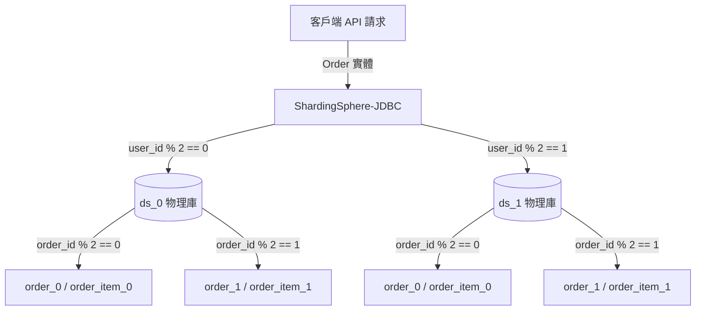
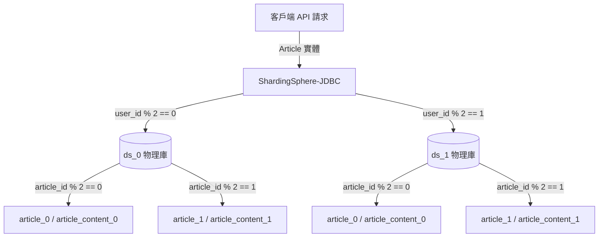
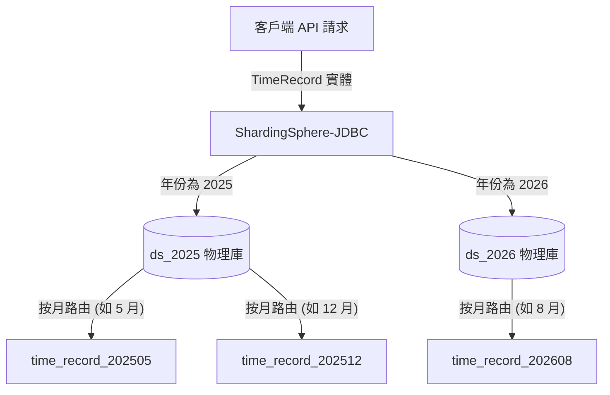
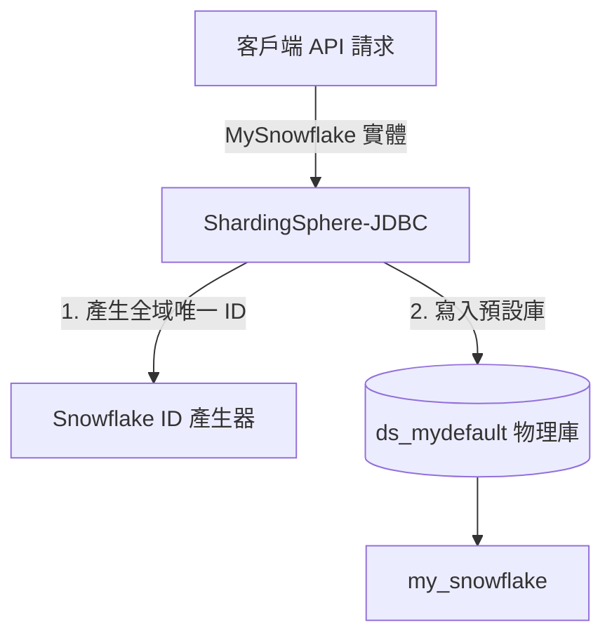
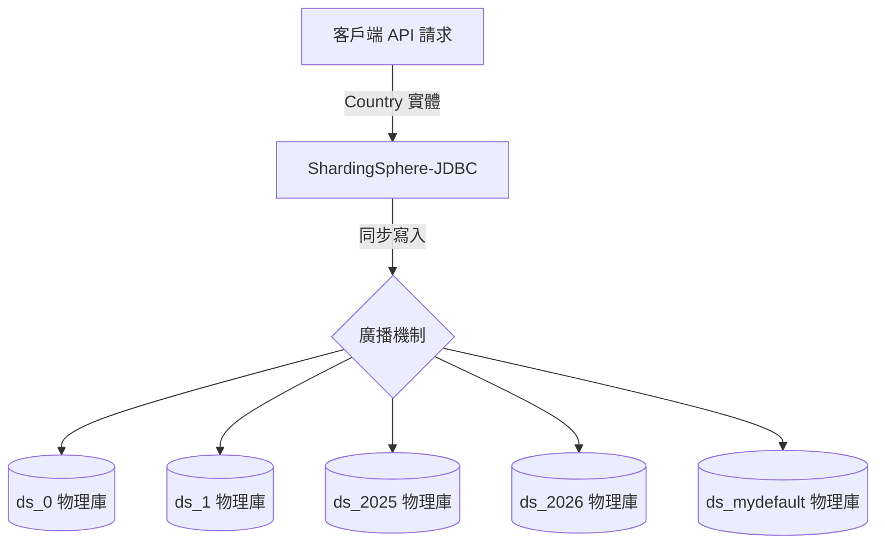

# ShardingSphere + Spring Boot & BDD 整合測試專案

本專案展示如何結合 **ShardingSphere-JDBC**、**Spring Boot**、**JPA** 與 **BDD** 進行分庫分表整合與自動化白箱測試。

---

## 🚀 專案說明

本專案為 **DEMO 專案**，您可以直接閱讀 `testCase/Features` 中的 `*.feature` 檔案來瞭解本專案成果與各場景的分片路由設計。

---

## 📝 BDD 測試場景與路由架構示意圖

本測試套件採用「**API 寫入 ➡️ 物理庫直連驗證**」的白箱模型，確保資料真實路由至目標位置。您可以透過以下各測試場景與其對應的架構示意圖瞭解各項分片路由規則：

### 1. 訂單分片與綁定表 🔗
* **Feature 連結**：[OrderSharding.feature](testCase/Features/OrderSharding.feature)
* **路由規則**：
  * 分庫：`user_id % 2` ➡️ `ds_0` (偶數) / `ds_1` (奇數)
  * 分表：`order_id % 2` ➡️ `order_0` (偶數) / `order_1` (奇數)
* **架構路由示意圖**：

### 2. 文章分片與 JPA 二級表 📝
* **Feature 連結**：[ArticleSharding.feature](testCase/Features/ArticleSharding.feature)
* **路由規則**：
  * 分庫：`user_id % 2` ➡️ `ds_0` (偶數) / `ds_1` (奇數)
  * 分表：`article_id % 2` ➡️ `article_0` (偶數) / `article_1` (奇數)
* **架構路由示意圖**：

### 3. 時間範圍與間隔分片 ⏳
* **Feature 連結**：[TimeRecordSharding.feature](testCase/Features/TimeRecordSharding.feature)
* **路由規則**：
  * 分庫（年份）：`2025` ➡️ `ds_2025` / `2026` ➡️ `ds_2026`
  * 分表（月份）：`yyyyMM` 格式按月分切（例如：`time_record_202505`、`time_record_202608`）
* **架構路由示意圖**：

### 4. 全域雪花 ID 驗證 ❄️
* **Feature 連結**：[SnowflakeId.feature](testCase/Features/SnowflakeId.feature)
* **路由規則**：
  * 主鍵由 ShardingSphere 內建 Snowflake 算法自動生成，並直接路由存儲至預設物理庫 `ds_mydefault` 的 `my_snowflake` 表。
* **架構路由示意圖**：

### 5. 廣播表多庫同步 📢
* **Feature 連結**：[BroadcastTable.feature](testCase/Features/BroadcastTable.feature)
* **路由規則**：
  * 對廣播表 `country` 的任何寫入都會被自動同步廣播寫入所有物理資料庫。
* **架構路由示意圖**：

